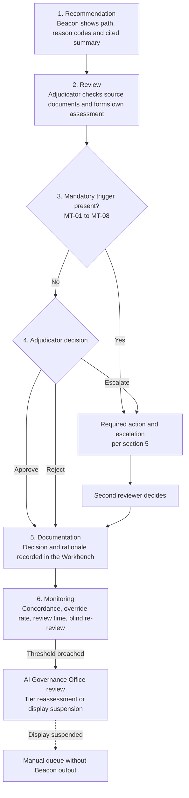

# Northstar Financial: Human Oversight Framework for Beacon

**Fictional case study. Northstar Financial and all figures are invented for portfolio purposes.**

**Document ID:** NF-AIG-003 | **Version:** 1.0 (draft for AI Governance Committee approval) | **Owner:** Head of Credit Adjudication, with the AI Governance Office | **Applies to:** Beacon (Intake NF-AI-2026-014), risk tier High

## 1. Purpose and scope

Beacon recommends and does not decide. This framework sets out what an adjudicator must do with a recommendation, when the adjudicator must override or escalate, how Northstar keeps the review real, and how it proves it. CTL-06 enforces the mandatory triggers in section 5. The framework supports risks R-03, R-04 and R-16 in the Risk Register.

In scope: the Review Priority Model output (path, score, reason codes), the Document Summarization Assistant output and the Adjudicator Workbench. Out of scope: credit policy and delegated lending authority limits, which Beacon does not change.

## 2. Design principles

1. **The adjudicator decides and is accountable.** No application is approved or declined without an adjudicator's decision, and no decision may rest on the Beacon score alone.
2. **Reasons come from the file.** Every rationale and adverse-action reason cites facts the adjudicator assessed in the source documents. It never cites the score, the path or "per Beacon".
3. **Oversight is measured and not assumed.** "A human reviews every file" is a claim. The evidence is rationale quality, blind re-review accuracy, override behaviour and review time (sections 6 and 8).
4. **Friction sits where the harm is.** The strictest requirements apply to Recommend Decline, because following it denies someone credit. Standard Review does not lower the checks an adjudicator must do. It only sets queue priority.
5. **If oversight cannot be recorded, the recommendation is not shown.** When logging fails or capture falls below the threshold, the Recommend Decline display is suspended (CTL-15).
6. **Incentives must not reward agreeing with the model.** Adjudicator performance measures must not use concordance with Beacon or a low override rate as a target. This rule belongs to the adjudicator performance framework outside Beacon and is tested only indirectly, through CTL-08.

## 3. The oversight flow

| Step | What happens | Who | Controls |
|---|---|---|---|
| 1 Recommendation | Beacon assigns one of three paths (Standard Review, Enhanced Review, Recommend Decline) and shows reason codes and a summary with a source citation on every figure. The path routes the file to a queue and does not complete it | Beacon | CTL-10; CTL-11 |
| 2 Review | The adjudicator opens the source documents, checks key figures against the citations and forms an assessment of the file | Adjudicator | CTL-11; CTL-23 |
| 3 Trigger check | The adjudicator checks the file against the mandatory triggers in section 5. The Workbench raises a flag automatically where it can | Adjudicator; Workbench | CTL-06; CTL-22; CTL-23 |
| 4 Decision | Approve, reject or escalate. The adjudicator may override the recommendation in either direction, within delegated lending authority | Adjudicator | CTL-06 |
| 5 Documentation | Decision recorded with model and prompt versions, the recommendation shown and the time it was displayed. A written rationale is required on every Recommend Decline file, whether it is followed or overridden | Adjudicator; Workbench | CTL-06; CTL-14 |
| 6 Monitoring | Concordance, override rate, review time, capture rate and blind re-review results are reported weekly in pilot and monthly after | Head of Credit Adjudication; AI Governance Office | CTL-07; CTL-08; CTL-15 |

## 4. What each path requires

| Path | Meaning | Minimum adjudicator action | Rationale |
|---|---|---|---|
| Standard Review | Beacon sees no need for extra scrutiny | Normal file review. All mandatory triggers still apply | Normal file note |
| Enhanced Review | Beacon suggests a closer look | Review the reason codes and the source documents they point to, and note what was checked | Normal file note recording what was checked |
| Recommend Decline | Beacon suggests the file may warrant a decline | Full independent review of the source documents, form own view, apply the triggers | Written rationale required whether the recommendation is followed or overridden. It must cite file facts and not the score |

Rules that apply to every path:
- A recommendation never produces an automatic decision or an automatic adverse-action notice.
- Any adjudicator may override in either direction without approval. An override is recorded and is never counted against the adjudicator.
- Approvals and declines follow existing lending authority limits. Beacon does not raise or lower an adjudicator's authority.
- Adverse-action reasons come from the adjudicator's own assessment of the file (CTL-10).

## 5. Mandatory override and escalation triggers

When a trigger applies, the adjudicator must take the required action, and the Workbench will not let the file be completed until the action is recorded (CTL-06). Definitions marked "to be set" are finalized by Credit Analytics and approved by the AI Governance Committee before pilot.

| ID | Trigger | Required action | Escalate to | Detected by |
|---|---|---|---|---|
| MT-01 | The summary and the source documents disagree on a figure that matters to the decision (income, obligations, balances, employer) | Decide from the source document, record the discrepancy and do not rely on the summary for that file | Team lead if the discrepancy could change the decision | Adjudicator; Workbench flag (CTL-23) |
| MT-02 | A summary statement has no valid source citation | Verify it in the source before using it, or disregard it | None, unless MT-01 also applies | Workbench flag (CTL-11) |
| MT-03 | A document contains hidden or instruction-like text | Do not rely on the summary. Treat the file as a manual review and refer the document | Fraud team. A confirmed injection becomes a security incident (CTL-33) | Workbench flag (CTL-22) |
| MT-04 | The recommendation rests on incomplete or stale data (for example missing bureau data), or looks inconsistent with the file | Do not rely on the score or path. Assess the file manually and record why | Team lead if unresolved | Adjudicator; Workbench flag where required fields are missing (to be built) |
| MT-05 | Limited-history applicant (definition to be set, for example thin-file or newcomer) and the path is Recommend Decline | Independent review and a documented second review before any decline | Team lead as second reviewer | Workbench flag (to be built) |
| MT-06 | A reason code or the file suggests the recommendation may reflect a protected characteristic or a close proxy (for example location or employer type) | Do not follow the recommendation on that basis. Assess the file on other facts and report the concern | AI Governance Office, through the incident intake (CTL-33) | Adjudicator |
| MT-07 | The applicant supplies material new information after the recommendation was produced (for example corrected income documents) | Treat the recommendation as stale. Re-run Beacon if the Workbench supports it, otherwise assess manually | None | Adjudicator |
| MT-08 | The Recommend Decline display is suspended or Beacon is unavailable | Process the file from the manual queue without Beacon output (CTL-15; CTL-21) | Automatic notice to the AI Governance Office (CTL-15) | Workbench |

Disagreeing with Beacon is not a trigger. It needs no escalation and no approval.

## 6. Preventing blind acceptance

Two failure modes matter. **Anchoring** is forming a view around the recommendation. **Rubber-stamping** is following it without a real review. Northstar uses four layers because no single one is enough.

| Layer | Mechanism | Control | What it stops |
|---|---|---|---|
| Design | Written rationale required on Recommend Decline files, with the Workbench blocking completion without it. A source link beside every summary figure | CTL-06; CTL-11 | Following the recommendation without engaging with the file |
| Process | Blind re-review: on a random sample (5 percent proposed) the recommendation is hidden until the adjudicator records a decision. Mandatory triggers and a second review for limited-history files | CTL-07; CTL-06 | Anchoring and over-reliance in the highest-risk cases |
| Measurement | Monthly concordance, override rate and review time reports. Rationale quality sampling, with Internal Audit testing 25 live rationales each quarter | CTL-08; CTL-06 | Rubber-stamping going unnoticed |
| People | Training on model limits and automation bias before Workbench access. New adjudicators assess files before viewing Beacon. Annual manual-only competency check. Fallback drills | CTL-09; CTL-34 | Skill erosion and dependence |

**A note on the metrics.** High concordance is not proof of rubber-stamping, because Beacon may simply be right. That is why concordance above 90 percent triggers a review and not a finding. The review compares four signals:
- Blind re-review: do adjudicators reach the same decision when they have not seen the recommendation? If yes, their agreement is independent and oversight is working.
- Review time: is it collapsing on Recommend Decline files compared with the pre-pilot baseline?
- Rationale quality: are rationales specific, or copied text?
- Override rate: a very low rate is a warning sign, and a very high rate suggests a model problem (R-02, R-06).

**What a good rationale looks like**

| Not acceptable | Acceptable |
|---|---|
| "Beacon recommends decline and the file agrees." | "Pay stubs show income of $3,400 a month (pay stub, page 2). Bank statements show $1,900 a month in existing obligations and two overdrafts in the last 60 days. The requested payment would take the applicant above the policy debt service limit. Declined on affordability." |
| "Score too low." | "Beacon recommended decline because of a high utilization reason code. I checked the statements and the balance is a one-time transfer, now repaid. Overriding to approve." |

## 7. Roles and authority

| Role | Authority and duties |
|---|---|
| Adjudicator | Makes the decision. May override either way within delegated authority. Applies the triggers and records the rationale. Reports fairness or security concerns without adverse consequence |
| Team lead | Second reviewer for MT-05. Handles escalations under MT-01 and MT-04. Reviews team-level concordance, override and review time data each month |
| Head of Credit Adjudication | Owns this framework and controls CTL-06 to CTL-09, CTL-15 and CTL-34. Reports to the AI Governance Office each month |
| AI Governance Office | Receives MT-06 concerns and threshold breaches. Reassesses the risk tier. May recommend suspension to the Chief Risk Officer |
| Model Risk Management | Challenges thresholds and confirms the oversight design supports the assumptions in the model validation |
| Director, Credit Analytics Engineering | Builds and maintains Workbench capture, logging and flags (CTL-14; CTL-15; OI-06) |
| Chief Risk Officer | Decides on suspension of Beacon for severe incidents (CTL-33) |

## 8. Monitoring, thresholds and escalation

Thresholds are starting values to calibrate against the pilot baseline (OI-08).

| Indicator | Frequency | Starting threshold | Action | Control |
|---|---|---|---|---|
| Concordance with Recommend Decline (team) | Weekly in pilot; monthly after | Above 90 percent over a month | AI Governance Office review and tier reassessment | CTL-08 |
| Override rate (team) | Weekly in pilot; monthly after | Below 3 percent over a month | AI Governance Office review and tier reassessment | CTL-08 |
| Rationale capture rate on Recommend Decline files | Weekly | Below 98 percent in a week | Suspend the Recommend Decline display and notify the AI Governance Office | CTL-15 |
| Logging availability | Continuous | Unavailable for more than 24 hours | Suspend the Recommend Decline display | CTL-15 |
| Median review time per file against the pre-pilot baseline | Weekly in pilot; monthly after | Sustained drop (set from the pilot baseline) | Review workload and rationale quality | CTL-15; CTL-08 |
| Blind re-review accuracy against a senior panel | Quarterly | Falling for two consecutive quarters | AI Governance Office review and training refresh | CTL-07 |
| Manual-only competency check pass rate | Annual | Target 100 percent | Retraining and a repeat check | CTL-09 |
| Fallback drill throughput | Twice a year | Below 70 percent of normal | Dated capacity plan and AI Governance Office review | CTL-34 |

Escalation ladder: adjudicator, team lead, Head of Credit Adjudication, AI Governance Office, then the Chief Risk Officer for any suspension decision (CTL-33).

## 9. When oversight is degraded

| Situation | What the adjudicator sees | What happens |
|---|---|---|
| LLM summarization disabled by feature flag | Source documents only, no summary | Review Priority Model output continues and the process is otherwise unchanged (CTL-21) |
| Recommend Decline display suspended | No Recommend Decline label or score | Files are handled as manual reviews until capture is restored and confirmed (CTL-15) |
| Beacon switched off | Manual queue only | The runbook in CTL-21 applies. Fallback drills (CTL-34) show whether teams can cope with normal volume |

## 10. Employee monitoring considerations

Concordance, override and review time data can describe individual adjudicators, which makes this employee monitoring. Legal, HR and Privacy must confirm what is permitted and how it is communicated to staff. This is jurisdiction-dependent and is not assumed. The design uses team-level data first. Individual-level data is used only for coaching and to investigate anomalies, and it is never used as a performance target (principle 6).

## 11. Traceability

| Risk | How this framework addresses it | Controls |
|---|---|---|
| R-03 Automation bias | Rationale gate, blind re-review, concordance monitoring, training | CTL-06; CTL-07; CTL-08; CTL-09 |
| R-04 Oversight in name only | Mandatory triggers, complete decision record, suspension when capture fails | CTL-06; CTL-08; CTL-14; CTL-15 |
| R-16 Skill erosion | Onboarding without Beacon, annual competency check, fallback drills | CTL-07; CTL-09; CTL-34 |
| R-05, R-10, R-13 (supporting) | Triggers MT-01 to MT-04 tell the adjudicator when not to rely on a summary or score | CTL-10; CTL-11; CTL-22; CTL-23 |
| R-01 (supporting) | MT-05 and MT-06 protect the highest-risk applicants and give adjudicators a route to raise fairness concerns. The fairness testing itself is in CTL-01 to CTL-04 | CTL-06; CTL-33 |

## 12. Framework alignment (indicative, verify before citing)

- **EU AI Act (benchmark only):** Article 14 covers human oversight, including understanding limits, awareness of automation bias, interpreting output, the ability to disregard or override, and a stop function. Verify current status and timelines.
- **NIST AI RMF:** MAP 3.5 (human oversight processes defined), GOVERN 3.2 (roles for human-AI oversight), MEASURE 2.4 and MANAGE 4.1 (monitoring and response). Check the wording against the Playbook.
- **ISO/IEC 42001:** Annex A.9 (use of AI systems) and Clauses 7.2 and 7.3 (competence and awareness). Verify clause references against a licensed copy.
- **Quebec Law 25 (Legal to confirm):** the notice duty for decisions based exclusively on automated processing is one reason the human review must be real, because a rubber-stamped review could be treated as an automated decision in substance. Quebec applicants are excluded from the pilot until this is reviewed.
- **OSFI E-23:** expectations for model use and oversight (confirm scope and effective date).

## 13. Limitations

- All thresholds and the 5 percent sample rate are starting values and must be calibrated on the pilot baseline.
- Blind re-review samples 5 percent of files. It cannot identify every adjudicator who rubber-stamps.
- Metrics can be gamed. An adjudicator could override at random to stay above the 3 percent trigger. That is why the review uses several signals, especially blind re-review accuracy and rationale quality.
- The rationale gate adds friction. If it is too heavy it produces typed boilerplate, which is why rationale quality is sampled.
- MT-04 and MT-05 depend on Workbench flags and a limited-history definition that do not exist yet (OI-06).
- This is a design. Nothing here has been built or tested with real adjudicators.
