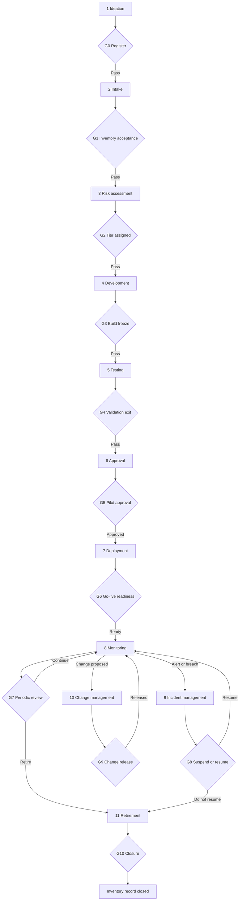

# Northstar Financial: AI Lifecycle Governance for Beacon

**Fictional case study. Northstar Financial and all figures are invented for portfolio purposes.**

**Document ID:** NF-AIG-005 | **Version:** 1.0 (draft for AI Governance Committee approval) | **Owner:** AI Governance Office (2nd line) | **Applies to:** Beacon (Intake NF-AI-2026-014), risk tier High

## 1. Purpose

This document sets out the stages an AI system passes through at Northstar, the decision gate that ends each stage and what a gate needs to see before it opens. Beacon is the worked example throughout. Each gate names who decides, who prepares the evidence, which controls produce that evidence and where Beacon stands. It uses the decision rights in the RACI (NF-AIG-004), the tiers in the methodology (NF-AIG-002) and the control IDs in the Control Matrix.

## 2. Gate rules

1. **No gate, no next stage.** A system cannot skip a gate. A failed or held gate sends it back to the stage before.
2. **Four outcomes:** Pass, Pass with conditions, Hold, Fail. Every condition has an owner and a date. A condition marked "before pilot" or "before go-live" cannot be deferred.
3. **No intake, no procurement, no production access.** Procurement raises no purchase order or contract for an AI product without an inventory ID. Access management grants no production data or system access to an AI system without an inventory record showing its gate status. Project funding beyond discovery needs G1 passed. These enforcement points are not yet controls in the Control Matrix (see limitations).
4. **Legal sign-off at every gate from G2 to G10** that no blocking legal item is open (CTL-27; APR-2). An open blocking item holds the gate.
5. **Every decision is recorded:** the decision, the date, the decider, any conditions, any dissent and the evidence reviewed. The record lives in the inventory entry.
6. **Decisions within 10 business days** of a complete pack (starting value). A gate open past that date is reported on the dashboard.
7. **Depth follows the tier (section 5).** The stages stay the same and the depth changes.
8. **Nobody decides a gate on their own work.** Model Risk Management and not Data Science validates at G4, and the Committee and not Engineering releases material changes at G9 (RACI design rule 2).

## 3. Stage-gate flow

A gate that fails or is held sends the system back to the stage before it, and it never skips forward. Stages 9 to 11 are event-driven and can occur at any time after go-live.

## 4. Gate overview

| Gate | After stage | Decision | Decided by | RACI ref |
|---|---|---|---|---|
| G0 | Ideation | Register the idea and proceed to intake | AI Governance Office | No row (assigned here) |
| G1 | Intake | Accept, accept with open items or return | AI Governance Office | INT-2 |
| G2 | Risk assessment | Assign the risk tier | AI Governance Office. Only the Committee may lower a tier | CLS-1 to CLS-3 |
| G3 | Development | Build freeze | AI Governance Office, with the Committee informed for High and Critical | No row (assigned here) |
| G4 | Testing | Validation exit: opinion that the system is ready for approval | Head of Model Risk Management issues the opinion. The AI Governance Office confirms the pack is complete | TST-2 |
| G5 | Approval | Approve the pilot and each rollout expansion | AI Governance Committee (High). Executive Risk Committee (Critical) | APR-1 |
| G6 | Deployment | Go-live readiness | AI Governance Office confirms all pre-go-live conditions are closed. Business owner authorizes switch-on | DEP-1 to DEP-5 (no single decision row) |
| G7 | Monitoring | Continue, restrict or expand | AI Governance Committee at each periodic review. AI Governance Office between reviews | APR-1; MON-2 |
| G8 | Incident management | Suspend, and later resume | Chief Risk Officer or delegate. Resumption by the same authority | INC-3 (resumption: no row) |
| G9 | Change management | Release a change | AI Governance Committee for material changes. Model owner for minor changes | CHG-3; CHG-1 |
| G10 | Retirement | Retire, then close the record | Business owner decides. AI Governance Office closes the record | RET-1; RET-4 |

## 5. How gates scale by tier

The stages stay the same and the depth changes with the tier (methodology section 7).

| Tier | Gates that apply | Approval at G5 | Validation at G4 | Monitoring at G7 |
|---|---|---|---|---|
| Low | G0 to G2, G5 and the event-driven gates G7 to G10 | AI Governance Office | Self-attestation, checked by the AI Governance Office | Annual attestation |
| Moderate | All gates. G3 and G4 are second-line desk reviews | Head of AI Governance and business owner | Second-line desk review | Quarterly metrics review |
| High | All gates | AI Governance Committee | Independent validation by Model Risk Management | Monthly. Reassessment every 6 months in pilot, then every 12 |
| Critical | All gates | Executive Risk Committee. Board Risk Committee informed | Independent validation plus Internal Audit review | Weekly during rollout, then monthly. Reassessment quarterly. Restricted rollout only |

## 6. The eleven stages

Each table gives the required activity, the decision gate and who decides, who is responsible, the evidence the gate needs, the approval criteria, the controls that produce the evidence and Beacon's position.

### Stage 1: Ideation (Gate G0)

| Item | Detail |
|---|---|
| Required activity | The business sponsor writes a one-page idea brief covering the problem, why AI is needed and the non-AI alternative. The AI Governance Office creates an inventory entry marked Idea and runs the four gate check questions in the methodology (section 3). |
| Decision gate and decider | G0 Register and proceed. The AI Governance Office decides. |
| Responsible | Business owner (as sponsor). AI Governance Office. |
| Required evidence | Idea brief. Inventory ID. Gate check record. |
| Approval criteria | All four gate check answers are No. Otherwise the idea continues only with a documented exception from the Executive Risk Committee. A named business owner at VP level or above. A non-AI alternative is described. No personal information has gone into any AI tool and no vendor has been engaged beyond public information and demos. |
| Controls | None. Methodology section 3 applies. |
| Beacon position | Not formally held. Beacon reached intake while already in Build, so G0 and G1 came late (section 8). |

### Stage 2: Intake (Gate G1)

| Item | Detail |
|---|---|
| Required activity | The business owner and technical owner complete the intake form (NF-AIG-001) and attest it. The AI Governance Office validates it against the closed-choice rules and consults Privacy, Compliance, Legal and Cybersecurity. Unknowns get an owner and a follow-up date and go into the Open Items Register. |
| Decision gate and decider | G1 Inventory acceptance. The AI Governance Office decides: accept, accept with open items or return (INT-2). Decision within 10 business days of a complete submission (starting value). |
| Responsible | Business owner and technical owner submit. AI Governance Office validates. |
| Required evidence | Attested intake. Validation notes. Open Items Register. Inventory record. |
| Approval criteria | Attested by a business owner at VP level or above. Every [T] field uses the closed options (free text is returned). Every UNKNOWN has an owner and a date. Second-line contacts are named. Out-of-scope uses are stated. |
| Controls | None. The intake form NF-AIG-001 is the control document. |
| Beacon position | Passed with open items on 2026-03-20. Ten open items (OI-01 to OI-10) were logged. |

### Stage 3: Risk assessment (Gate G2)

| Item | Detail |
|---|---|
| Required activity | The AI Governance Office runs the gate check, rates the seven impact dimensions and three amplifiers and calculates the tier. It runs the sensitivity analysis, opens the Risk Register and names a risk owner for each risk. It starts the Privacy Impact Assessment and the threat model and begins the regulatory obligations register. |
| Decision gate and decider | G2 Tier assignment. The AI Governance Office assigns the tier (CLS-1). Only the AI Governance Committee may lower one (CLS-3). For High and Critical the Committee is informed. |
| Responsible | AI Governance Office. Consulted: Privacy, Cybersecurity, Legal, Compliance, Data Science. |
| Required evidence | Scored assessment with the basis for each rating. Sensitivity table. Initial Risk Register. PIA and threat model plans with dates. Initial obligations register. |
| Approval criteria | Gate check clear. Every rating has a documented basis. The tier is inside the impact window and the floor rules are applied. Every risk has an owner and a recommended control with a control owner. Open items have dates. |
| Controls | CTL-27 (obligations register started). |
| Beacon position | Passed 2026-03-20 as High (score 16). The Risk Register holds 16 risks and the Control Matrix 34 controls, all at design stage. |

### Stage 4: Development (Gate G3)

| Item | Detail |
|---|---|
| Required activity | Data Science and Engineering build the Review Priority Model and the Workbench within the approved scope. They document the feature list and data lineage, run the proxy audit and design the capture, logging and mandatory-trigger flags. Privacy completes the PIA and Cybersecurity completes the threat model. The AI Governance Committee sets fairness metrics and thresholds before any test results exist. All builds go under change control. |
| Decision gate and decider | G3 Build freeze. The AI Governance Office decides. The Committee is informed for High and Critical. |
| Responsible | Data Science, Engineering and Product build. Privacy, Cybersecurity and Legal assess. The AI Governance Committee sets thresholds (APR-5). |
| Required evidence | Feature register with sign-off and proxy analysis (CTL-01). Signed PIA (CTL-18). Signed threat model (CTL-24). Legal memos on consent (OI-01) and on the lawfulness of proxy-based fairness testing (OI-09). Approved fairness metrics and thresholds (OI-07). Documented reject inference approach. Approved Human Oversight Framework (NF-AIG-003). Workbench design covering capture, logging and flags. |
| Approval criteria | No high-rated PIA finding open. Every retained high-proxy feature has a dated Committee decision. Legal has confirmed the fairness testing methods are lawful. If Legal rules them out, the tier is re-scored (methodology section 8 shows this moves Beacon to Critical). Thresholds are approved before testing begins, so results cannot shape them. Builds are versioned and hashed. Until CTL-16 and CTL-19 are complete, only synthetic or de-identified documents approved by Privacy go to Meridian. |
| Controls | CTL-01; CTL-02 (thresholds); CTL-06 and CTL-14 (design); CTL-18; CTL-24; CTL-31; CTL-32. |
| Beacon position | In progress. G3 cannot open until OI-01, OI-02, OI-03, OI-07 and OI-09 are closed (section 8). |

### Stage 5: Testing (Gate G4)

| Item | Detail |
|---|---|
| Required activity | Model Risk Management independently validates Beacon: conceptual soundness, out-of-time and segment performance, the reject inference approach and reason code behaviour. Data Science runs the fairness tests using three proxy methods and the summary accuracy tests on a labelled set. Cybersecurity red-teams the summarization pipeline. Engineering records the canary baseline. |
| Decision gate and decider | G4 Validation exit. The Head of Model Risk Management issues the validation opinion. The AI Governance Office confirms the approval pack is complete. |
| Responsible | Model Risk Management (TST-2). Data Science (TST-1; TST-4). Cybersecurity (TST-3). Engineering. |
| Required evidence | Validation report and findings log (CTL-04). Fairness test report and challenge memo (CTL-02). Reason code faithfulness result (CTL-10). Summary test results against tolerances (CTL-30). Red team report and closure evidence (CTL-23). Canary baseline (CTL-20). |
| Approval criteria | Every high-rated validation finding is closed with evidence dated before the gate. Fairness results are compared with the thresholds approved at G3, and any breach is fixed or explained to the Committee. Error and omission rates are inside tolerance. No high-rated red team finding is open. Reason codes are shown to reflect the factors driving each score. The validator is independent of the developers. A failed test returns Beacon to Development. |
| Controls | CTL-02; CTL-04; CTL-10; CTL-20; CTL-23; CTL-30. |
| Beacon position | Not reached. |

### Stage 6: Approval (Gate G5)

| Item | Detail |
|---|---|
| Required activity | The AI Governance Office assembles the approval pack. Legal signs off that no blocking legal item is open. The Executive Risk Committee records the regulator engagement decision. Vendor Risk and Legal deliver the executed Meridian contract. Credit Operations delivers the baseline measurements. The Committee reviews residual risk and sets the conditions of approval. |
| Decision gate and decider | G5 Pilot approval, and again for each rollout expansion (APR-1). The AI Governance Committee decides for High. The Executive Risk Committee decides for Critical. |
| Responsible | AI Governance Office prepares the pack. Vendor Risk and Legal deliver the vendor terms (DEP-2). The business owner presents. Compliance, Privacy and Cybersecurity are consulted. |
| Required evidence | Intake, tier and Risk Register with residual ratings. Control status by Designed, In build or Operating. Validation opinion and fairness report. Signed PIA. Legal gate sign-off (CTL-27). Regulator engagement memo (CTL-29). Executed vendor terms and approved sub-processor register (CTL-16; CTL-19). Baseline measurements (OI-08). Vendor concentration assessment (OI-10). Pilot scope statement. Conditions of approval. Record of any dissent. |
| Approval criteria | G4 passed. No blocking legal item open. The regulator engagement decision is dated before approval. Required vendor terms are 100 percent executed. No high-rated PIA finding open. Residual risks are accepted in writing by the business owner and the Committee. R-01 stays High after controls in the Risk Register, so the Committee must accept it explicitly and record why the pilot scope is an acceptable limit. Pilot scope is fixed: two adjudication teams, Ontario applicants only, about 10 percent of volume (roughly 18,000 applications a year) and Quebec excluded. |
| Controls | CTL-04; CTL-16; CTL-18; CTL-19; CTL-27; CTL-29. |
| Beacon position | Target pilot date 2027-01-18. Wider rollout not before 2027-06-01, and only through a new G5 with a fresh fairness test (CTL-02). |

### Stage 7: Deployment (Gate G6)

| Item | Detail |
|---|---|
| Required activity | Engineering releases the approved versions to production, hashes them and records them in the approved version register. Workbench capture, the rationale gate and the trigger flags go live. Monitoring reports, the daily canary run, integrity checks and prompt log scans start. Adjudicators complete training before they get access. The switch-off runbook is tested end to end and the incident playbook exercise is run. |
| Decision gate and decider | G6 Go-live readiness. The AI Governance Office confirms every pre-go-live condition is closed. The business owner authorizes switch-on. |
| Responsible | Engineering (DEP-1; DEP-4). Business owner (DEP-5). Privacy (DEP-3). Cybersecurity. |
| Required evidence | Release record with versions and hashes (CTL-25; CTL-32). Capture reconciliation results (CTL-14). Training records against the Workbench user list (CTL-09). Switch-off test record with timings (CTL-21). Tabletop exercise report (CTL-26). Live monitoring reports with thresholds (CTL-03; CTL-08; CTL-12). Masking test on dummy identifiers (CTL-17). Vendor configuration check (CTL-16). |
| Approval criteria | Capture works on every test file and the daily reconciliation is clean (OI-06 closed). No Workbench user without completed training. The switch-off stopped output within the target time and the manual queue took over. The exercise is complete. Production versions match the approved register. Every pre-go-live condition of approval is closed, and none may be deferred. |
| Controls | CTL-03; CTL-08; CTL-09; CTL-12; CTL-14; CTL-16; CTL-17; CTL-20; CTL-21; CTL-25; CTL-26; CTL-32. |
| Beacon position | Not reached. OI-06 (capture) is due 2026-06-01 and must be live and reconciled here. |

### Stage 8: Monitoring (Gate G7)

| Item | Detail |
|---|---|
| Required activity | Run the monitoring cadence: fairness ratios, drift, backtests, oversight indicators, capture and citation checks, summary sampling, privacy log scans, and canary and integrity checks. Internal Audit tests the controls using the matrix test procedures. The AI Governance Office consolidates results and keeps the register and matrix current. The tier is reassessed on the schedule in the methodology. |
| Decision gate and decider | G7 Periodic review: continue, restrict or expand. The AI Governance Committee decides at each reassessment (every 6 months in the pilot, then every 12 months for High tier) and for each expansion (APR-1). Between reviews the AI Governance Office monitors (MON-2) and may raise the tier at any time (CLS-2). |
| Responsible | Data Science and Engineering produce the reports (MON-1). Business owner (MON-3). Privacy (MON-5). Cybersecurity (MON-6). Compliance (MON-7). Internal Audit tests (TST-5). |
| Required evidence | Monitoring reports. Breach and disposition logs. Control test results. Reassessment memo. Updated register and matrix status. For an expansion: a proposal with a fresh fairness test on the new population (CTL-02) and an amended intake (CHG-6). |
| Approval criteria | To continue: indicators are within thresholds, or each breach has a disposition inside its timeline (for example 5 business days for fairness ratios). No key control test failure is left uncorrected. No High-rated finding is past its due date. The register was reviewed. To expand: pilot evidence is reviewed, concordance and blind re-review results are acceptable, the fairness test on the new population passes and any move into Quebec has its Law 25 review (Legal to confirm). |
| Controls | CTL-03; CTL-05; CTL-07; CTL-08; CTL-11; CTL-12; CTL-15; CTL-17; CTL-20; CTL-25; CTL-28; CTL-30; CTL-34. |
| Beacon position | Not reached. Timing conflict to resolve: the intake says wider rollout is not before 2027-06-01, but the first six-month reassessment after a 2027-01-18 pilot start falls on 2027-07-18. Outcomes lag 6 to 12 months, so an early expansion would rest on drift and override data alone. |

### Stage 9: Incident management (Gate G8)

| Item | Detail |
|---|---|
| Required activity | Alerts from all monitoring go to one AI incident intake. The AI Governance Office triages and sets a severity. The responsible leads contain the incident, using the switch-off runbook where needed. Teams investigate, find the root cause, assess harm and breach reporting duties, remediate, verify the fix and run a post-incident review. Artifact 9 walks through one incident. |
| Decision gate and decider | G8 Suspend, then resume. The Chief Risk Officer or a delegate decides to suspend (INC-3). The Head of Credit Adjudication or the CISO may suspend alone for defined triggers, with the Chief Risk Officer informed within 4 hours. Resumption is decided by the same authority that suspended. |
| Responsible | AI Governance Office runs intake and triage (INC-2). Investigation and root cause (INC-4). Privacy leads the breach assessment (INC-5). The business owner is accountable for remediation (INC-6). |
| Required evidence | Incident ticket with timestamps. Severity. Suspension record. Root cause report. Harm and breach assessment. Remediation and verification record. Post-incident review and action tracker. |
| Approval criteria | Suspend: Severity 1 or 2 incidents are notified to the AI Governance Office and Chief Risk Officer within 4 hours, with a suspension decision within 24 hours. High-severity alerts are triaged inside 1 business day. Resume: root cause identified, the failed control re-tested, affected individuals remediated where required, breach reporting decisions recorded and Legal sign-off given. A fix that changes the model or its configuration goes through G9 first. Post-incident review inside 30 days with no overdue actions. |
| Controls | CTL-15; CTL-21; CTL-26; CTL-33. |
| Beacon position | Not reached. The playbook exercise is due before the pilot. |

### Stage 10: Change management (Gate G9)

| Item | Detail |
|---|---|
| Required activity | Each change is classified before work starts as material, minor or configuration. Material changes include retrains, feature changes, score thresholds and path cut-offs, prompt edits, vendor model updates and any change to LLM capability settings (tool calling, write access, retrieval). Material changes are re-validated and the fairness test is re-run. Vendor updates are accepted only after the canary test set. The builder never releases their own change. |
| Decision gate and decider | G9 Change release. The AI Governance Committee approves material changes after Model Risk Management re-validation (CHG-2; CHG-3). The model owner approves minor changes and notifies Model Risk Management (CHG-1). Rolling back to the last approved version is allowed at any time without Committee approval and must be documented within 1 business day. |
| Responsible | Engineering runs the process (CHG-1). Data Science and Model Risk Management (CHG-2; CHG-5). Business owner for scope extensions (CHG-6). |
| Required evidence | Change ticket with classification. Re-validation report. Fairness re-test results (CTL-02). Vendor update acceptance record (CTL-20). Approvals showing builder and releaser differ. Updated hashes and approved version register (CTL-32). Updated documentation. |
| Approval criteria | Classified before work began. Material changes re-validated and fairness-tested before release. A second approver enforced by the pipeline. Retrains assessed for feedback loop effects (CTL-13). A change that adds tool calling, write access or retrieval to the LLM triggers a tier reassessment because it changes the amplifier scores. A new population, province, product or use needs an amended intake and re-tiering (CHG-6). |
| Controls | CTL-02; CTL-04; CTL-13; CTL-20; CTL-22; CTL-31; CTL-32. |
| Beacon position | Not reached. The change process must apply from the first build version (G3). |

### Stage 11: Retirement (Gate G10)

| Item | Detail |
|---|---|
| Required activity | The business owner decides to retire or replace Beacon. Engineering runs the 90-day exit plan: return the vendor data, obtain a deletion certificate, return lending to the manual queue and apply retention and deletion rules. Logs and model artifacts are archived per policy. The AI Governance Office files a retirement report and closes the inventory record. |
| Decision gate and decider | G10 Retirement decision and closure. The business owner decides (RET-1). The AI Governance Office closes the record (RET-4). The Committee or the Chief Risk Officer may require suspension at any time, but only the business owner decides retirement. |
| Responsible | Engineering (RET-2). Privacy is accountable for retention and deletion (RET-3). Product prepares the transition. |
| Required evidence | Retirement decision record. Exit plan execution log. Vendor deletion certificate. Retention and deletion job logs. Manual queue capacity result. Archive index. Retirement report with lessons learned. |
| Approval criteria | The manual queue runs at normal capacity (the latest fallback drill result, CTL-34). Deletion certificate received. Retention applied to scores, reason codes, prompts and summaries (7 years assumed for scores and reason codes, pending Privacy confirmation). Archived artifacts and logs are access-controlled. No open incidents or remediation actions. Register and matrix closed out. |
| Controls | CTL-17; CTL-21; CTL-34. |
| Beacon position | Not reached. Retirement is a design plan only. |

## 7. Systems found without intake

A system found in use without intake enters at G1 marked Live (retroactive). The AI Governance Office assigns a tier at G2 within 30 days (starting value). The business owner must then either bring the system through G3 to G5 or retire it through G10, within a period the Committee sets. The share of systems found after deployment is a governance KPI.

## 8. Beacon: where it stands

| Gate | Status | Note |
|---|---|---|
| G0 | Not formally held | Beacon reached intake while already in Build. Design choices such as the feature set and the vendor were made before governance review. Recorded as a process lesson |
| G1 | Passed with open items, 2026-03-20 | Ten open items logged |
| G2 | Passed, 2026-03-20 | High, score 16 |
| G3 | Pending | Blocked by OI-01, OI-02, OI-03, OI-07 and OI-09 |
| G4 | Pending | Depends on G3 |
| G5 | Pending | Pilot target 2027-01-18. Needs OI-04, OI-05, OI-08 and OI-10 closed |
| G6 | Pending | Needs OI-06 live and reconciled |
| G7 to G10 | Not reached | Event-driven or later |

Open items from the intake, and the gate each must close by:

| Open item | Subject | Due (from intake) | Must close by |
|---|---|---|---|
| OI-01 | Consent wording and purpose limitation | 2026-04-15 | G3 |
| OI-02 | Privacy Impact Assessment | 2026-05-01 | G3 |
| OI-03 | Feature audit for sensitive attributes and proxies | 2026-04-30 | G3 |
| OI-07 | Fairness metrics and thresholds | 2026-05-15 | G3 |
| OI-09 | Legal opinion: Law 25 notice, regulator engagement, proxy inference for testing | 2026-04-30 | G3 (the regulator engagement part by G5) |
| OI-04 | Vendor security assessment, zero-retention addendum and contract terms | 2026-05-15 | G5 |
| OI-05 | Vendor sub-processor list | 2026-04-30 | G5 |
| OI-08 | Baseline handling time and decision consistency | 2026-05-01 | G5 |
| OI-10 | Vendor concentration check | 2026-05-15 | G5 |
| OI-06 | Workbench override and rationale capture | 2026-06-01 | G3 (design) and G6 (live) |

## 9. Lifecycle metrics for the dashboard

- Systems in the inventory by lifecycle stage and tier.
- Gates open beyond 10 business days with a complete pack.
- Conditions of approval overdue, by gate.
- Gate holds and failures by gate, which shows where the process breaks.
- Days from intake to tier assignment (G2).
- Systems found after deployment (retroactive intakes) as a share of the inventory.

## 10. Checks

- There are 11 stages and 11 gates, one gate per stage. All 34 controls in the Control Matrix are cited at least once and no cited control ID is missing from it.
- Thresholds match the Risk Register, Control Matrix and Human Oversight Framework: 4 hours and 24 hours for Severity 1 or 2 incidents, 1 business day for high-severity triage, 5 business days for fairness breaches, 30 days for post-incident reviews and a 100 percent capture target for Recommend Decline files.
- Every open item from OI-01 to OI-10 is assigned to a gate (section 8). OI-06 is split between design (G3) and live (G6), and OI-09 between G3 and G5.
- Decisions with no dedicated row in the RACI: G0, G3, the switch-on authorization at G6 and resumption at G8. This document assigns them. The RACI would need matching rows if this document is adopted.
- Five rules here are not written in the other artifacts: (a) only synthetic or de-identified documents go to Meridian until CTL-16 and CTL-19 are complete; (b) Legal signs off at every gate from G2; (c) the authority that suspends Beacon also decides resumption; (d) adding tool calling, write access or retrieval to the LLM triggers a tier reassessment; (e) rollback to the approved version needs no Committee approval.
- The 10 business day decision time and the 30 day limit for retroactive systems are starting values to calibrate.

## 11. Framework alignment (indicative, verify before citing)

- **NIST AI RMF:** GOVERN 1.6 (inventory of AI systems), GOVERN 1.7 (safe decommissioning), MANAGE 4.1 (post-deployment monitoring) and MANAGE 4.3 (incident communication). Check the wording against the Playbook.
- **ISO/IEC 42001:** Clause 8.1 (operational planning and control), Annex A.6 (AI system life cycle) and Clause 10 (improvement). Verify clause references against a licensed copy.
- **EU AI Act (benchmark only):** Article 9 (risk management across the life cycle), Article 17 (quality management), Article 72 (post-market monitoring) and Article 73 (serious incident reporting). Verify current status and timelines.
- **Canadian expectations:** OSFI Guideline E-23 expects model risk management across the model life cycle. Law 25 requires privacy impact assessments in defined cases and privacy regulators encourage them elsewhere (Legal to confirm scope and effective dates).

## 12. Limitations

- Gate timings are starting values to calibrate against real Committee capacity. One Committee that approves pilots, expansions and material changes can become a bottleneck, and the design has no fast track other than rollback.
- The enforcement points in rule 3 (procurement, access management and funding) are not controls in the Control Matrix. A real programme would add them, because without them the intake can be bypassed. This is listed as a gap and the matrix has not been changed.
- Beacon reached intake while in Build. That is a late G0 and G1, and it means the feature set and vendor were chosen before review. G3 exists to catch what that could have locked in.
- The rollout date in the intake (not before 2027-06-01) is earlier than the first six-month reassessment (2027-07-18). With outcomes lagging 6 to 12 months, the evidence for early expansion would be thin. Resolve this before G5.
- G6 switch-on and G8 resumption are not in the RACI. They are assigned in this document only.
- A gate is a point-in-time checkpoint. It does not show that controls keep working afterwards. That evidence comes from monitoring (G7) and Internal Audit testing (TST-5).
- Rollback without Committee approval reduces harm quickly but can restore an older version with known weaknesses. The next-day documentation is the check.
- This is a design. No gate has been run and no Committee has reviewed a pack. Pack contents and decision times have not been tested with real teams.
- Depth for Low and Moderate tiers is described at summary level only (section 5). Beacon is High, so only the High path is worked in detail.

