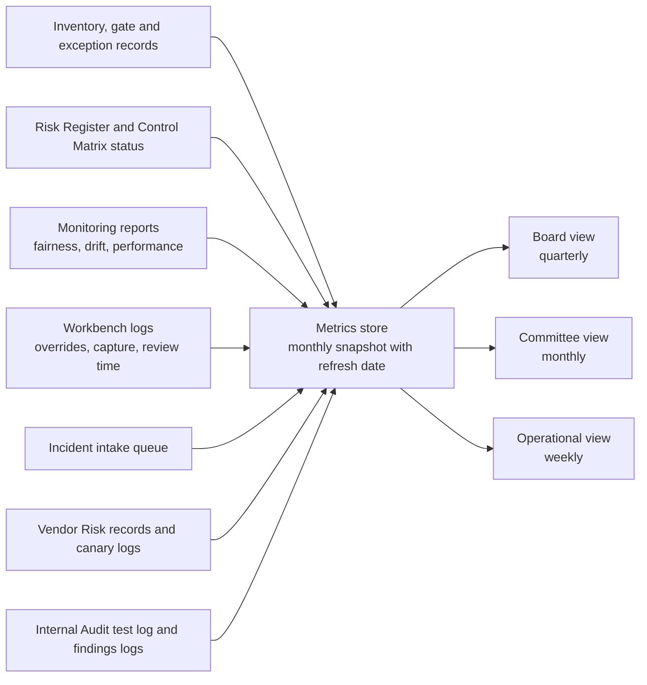

# Northstar Financial: AI Governance Dashboard Specification

**Fictional case study. Northstar Financial and all figures are invented for portfolio purposes. Every value in sections 7 to 9 is mock data.**

**Document ID:** NF-AIG-007 | **Version:** 1.0 (draft for AI Governance Committee approval) | **Owner:** AI Governance Office (2nd line) | **Mock snapshot date:** 2027-04-30

## 1. Purpose

The dashboard tells leadership three things: whether AI at Northstar is inside the risk appetite, where risk is moving and what decision is needed. It is built from the artifacts already in this case study, so every metric traces to a control, a risk or a gate. A metric with no owner and no action when it turns red is not on it.

## 2. Views and audiences

| View | Audience | Frequency | Metrics |
|---|---|---|---|
| Board | Board Risk Committee | Quarterly | A2, B1, B2, B4, B5, C1, C2, D1, plus the decisions list (8 metrics) |
| Committee | Executive Risk Committee and AI Governance Committee | Monthly | All 18 metrics, with drill-down per system |
| Operational | AI Governance Office, Credit Adjudication, Credit Analytics | Weekly, and daily for items under heightened monitoring | A4, A6, B2, C1 to C6, D1 |

## 3. Design rules

1. **Thresholds are set before the data is seen.** A threshold chosen after looking at the number is a description and not a control.
2. **Every count shows its denominator.** "7 open findings" means little without the number of systems and the age of each finding.
3. **Trend beats snapshot.** Every metric shows at least its last four readings.
4. **There is no composite AI risk score.** A single number hides which control is failing, and a green average can cover a red system.
5. **Every metric has one named owner, and every red has a named action.** Reds are escalated within the timelines in the incident and gate rules.
6. **Leading and lagging indicators are labelled.** Leading: PSI, override, capture, training. Lagging: Gini, incidents, complaints.
7. **Every metric shows when it was last refreshed.** A metric older than its refresh interval shows as stale and counts as amber.
8. **Oversight metrics are never individual performance targets.** Override rate and concordance are read at team level to check the oversight design (Human Oversight Framework, principle 6).
9. **Definitions are versioned.** Changing a definition or threshold needs a Committee decision and a note on the dashboard.

## 4. Data flow

## 5. Metric catalogue

Thresholds are starting values for the AI Governance Committee to calibrate. Where a threshold comes from an earlier artifact, the source is named.

### Panel A: Inventory and lifecycle

| ID | Metric and definition | Source | Green / Amber / Red | Owner and frequency | What it tells leadership |
|---|---|---|---|---|---|
| A1 | **AI systems in inventory by lifecycle stage.** Count of active inventory records at each stage from Idea to Live, plus systems retired in the last 12 months | Inventory record and gate log (G0 to G10) | Context, no rating. Red if any system is live without a passed G6 record | AI Governance Office. Monthly | How much AI Northstar runs and where it sits in the process. Growth shows where governance workload is heading |
| A2 | **Systems by risk tier.** Count of active systems at Low, Moderate, High and Critical | Tier assigned at G2 (methodology) | Context, no rating. Red if any Critical system is live outside a restricted rollout | AI Governance Office. Monthly | Where high-risk AI is concentrated. A shift toward High and Critical means more validation and Committee load |
| A3 | **Retroactive intakes.** Systems found after deployment as a share of the inventory | Inventory. Discovery through procurement and access reviews | Green under 5 percent. Amber 5 to 15 percent. Red over 15 percent, or any High or Critical system found live without a passed G5 | AI Governance Office. Monthly | Whether the intake gate is being bypassed. A high share means the rest of the dashboard covers only part of the AI in use |
| A4 | **Gates open beyond 10 business days.** Gates with a complete pack and no decision after 10 business days. Also shows gate holds and failures by gate | Gate log | Green 0. Amber 1 to 2. Red 3 or more, or any beyond 20 business days | AI Governance Committee chair. Weekly | Whether governance is a bottleneck. Long waits push teams to work around the process. Holds and failures show where the process breaks |
| A5 | **Median business days from complete intake to tier assignment (G2)** | Gate log | Green 20 or fewer. Amber 21 to 30. Red over 30 | AI Governance Office. Monthly | Speed of the front door. Slow intake drives retroactive systems (A3) |
| A6 | **Conditions of approval overdue.** Conditions set at a gate that are past their date | Gate decision records | Green 0. Amber 1 to 2, each under 30 days late. Red any pre-pilot or pre-go-live condition overdue, or any over 30 days | Business owners. Weekly | Whether approvals are honoured after the meeting. Overdue conditions mean accepted risk is not being reduced |

### Panel B: Risk and control

| ID | Metric and definition | Source | Green / Amber / Red | Owner and frequency | What it tells leadership |
|---|---|---|---|---|---|
| B1 | **Overdue risk assessments.** Systems past their reassessment date (High: every 6 months in pilot, then 12. Moderate: 12. Low: 24) | Inventory and methodology section 7 | Green 0. Amber Low or Moderate system under 30 days overdue. Red any High or Critical system overdue, or any overdue 30 days or more | AI Governance Office. Monthly | Whether risk ratings are current. A stale tier means the treatment may no longer fit the system |
| B2 | **Unresolved high-rated findings.** Open findings rated high from validation, red team, PIA, Internal Audit and incident reviews, and how many are past due | Findings logs (CTL-04, CTL-18, CTL-23, Internal Audit) | Green none past due. Amber past due under 30 days. Red any past due 30 days or more, or any open at an approval gate | Head of Model Risk Management and finding owners. Weekly | The backlog of known risk that has not been fixed. Ageing matters more than the count |
| B3 | **Control implementation status.** Controls by Designed, In build or Operating, and controls with an open design gap | Control Matrix status column (to be added) and incident actions | Green all controls of live systems Operating, or a dated plan. Amber any In build past its date, or any open design gap. Red a Designed-only control on a live High system past its date | Control owners. Monthly | How much of the control set is real and how much is planned. Stops the matrix being read as a description of what exists |
| B4 | **Control testing results.** Internal Audit tests completed against due, pass rate and failed-control remediation overdue | Internal Audit test log (test procedures in the Control Matrix) | Green 95 percent or more of due tests done, pass rate 90 percent or more and no overdue remediation. Red under 85 percent done, pass rate under 80 percent, or a failed control on a High system with no dated plan. Amber otherwise | Internal Audit. Quarterly | Independent evidence that controls work, as opposed to the owner's own report. The strongest evidence on the dashboard |
| B5 | **Policy exceptions.** Active exceptions by type (gate check exception, deferred condition, downward tier override) and expired ones | Exception register and Committee minutes | Green none past expiry and within Committee appetite. Amber any past expiry under 30 days. Red any past expiry 30 days or more, or any exception on a High or Critical system without recorded Committee approval | AI Governance Committee. Monthly | How often the rules bend. A rising count means the rules do not fit or people work around them. Downward tier overrides show pressure on classification |

### Panel C: Model behaviour and oversight

| ID | Metric and definition | Source | Green / Amber / Red | Owner and frequency | What it tells leadership |
|---|---|---|---|---|---|
| C1 | **AI incidents.** Count in the last 90 days by severity, response timeliness against targets and fault-to-detection time | Incident intake queue (CTL-33) | Green no Severity 1 or 2. Amber one Severity 2 with all targets met. Red any Severity 1, any target missed on a Severity 1 or 2 (notification within 4 hours, suspension decision within 24 hours), or more than one Severity 2 | AI Governance Office. Monthly, weekly to operations | Whether faults are happening and how well Northstar responds. Fault-to-detection time, known only after the fact, shows how long harm ran unseen |
| C2 | **Fairness ratio.** For each system with inferred groups, the group's Standard Review rate divided by the reference group's, weekly and rolling four-week | Fairness report (CTL-03) | Green 0.90 or above. Amber 0.80 to 0.89. Red below 0.80. Formal triggers (R-01): below 0.80 in any month, or below 0.90 for two consecutive months. Under heightened monitoring, below 0.85 triggers a same-day review | Head of Credit Risk Analytics. Weekly | Whether outcomes differ between groups. It is a screening signal only. It does not prove or rule out discrimination, and 0.80 is not a Canadian legal standard |
| C3 | **Performance and stability.** Gini against the validation baseline, and PSI on the score and the top 10 features | Monitoring report (CTL-05, CTL-12) | Green PSI 0.10 or below and Gini within 5 percent (relative) of baseline. Amber PSI 0.10 to 0.25, or Gini down 5 to 10 percent. Red PSI above 0.25 for two consecutive months (R-06), or Gini down more than 10 percent (R-02). Outcomes lag 6 to 12 months, so early on only PSI is available | Head of Credit Risk Analytics. Monthly | Whether the model still sees the world it was built for. PSI is the early warning and Gini is the confirmation that arrives late |
| C4 | **Override and concordance on Recommend Decline files.** Share of files where the final decision is decline (concordance), approve (override) or escalate | Workbench log (CTL-08) | Green concordance 90 percent or below and override 3 to 20 percent. Red concordance above 90 percent or override below 3 percent (CTL-08 review and tier reassessment). Amber override above 20 percent (possible model error) | Head of Credit Adjudication. Weekly in pilot, monthly after | Whether the human review is real. Both extremes matter: too little disagreement suggests rubber-stamping, too much suggests the model is wrong |
| C5 | **Oversight capture and review time.** Rationale capture rate on Recommend Decline files, and median review time on those files against the pre-pilot baseline | Workbench log (CTL-14, CTL-15) | Capture: green 99 percent or above, amber 98 to under 99, red under 98 (display suspended, CTL-15). Review time: green within 25 percent of baseline, amber 25 to 40 percent below, red more than 40 percent below (starting values, not yet in the framework) | Head of Credit Adjudication. Weekly | Whether the record proves oversight happened and whether time pressure is squeezing it. Shrinking review time on the highest-risk path is an early sign of rubber-stamping |
| C6 | **Blind re-review and training.** Agreement of blind re-review decisions with a senior panel, and adjudicators with current training and a passed competency check | Blind sample log and training records (CTL-07, CTL-09) | Green accuracy stable or rising and every user trained. Amber accuracy down for one quarter. Red accuracy down two consecutive quarters (R-16), or any user with access and no current training | Head of Credit Adjudication. Quarterly, training weekly | Whether adjudicators can still judge without the model. The independent check on the oversight metrics above |

### Panel D: Third parties

| ID | Metric and definition | Source | Green / Amber / Red | Owner and frequency | What it tells leadership |
|---|---|---|---|---|---|
| D1 | **Vendor issues.** Live AI-related vendors with all required contract terms executed, SLA breaches per quarter, unannounced model changes caught by the canary set, sub-processor changes awaiting approval and vendor incidents | Vendor Risk records and canary logs (CTL-19, CTL-20) | Green all required terms executed, no unannounced model changes and no vendor incident with late notice. Amber one required term open with a dated plan, or an SLA breach. Red any unannounced model change, any late incident notice, or an open term with no plan | Head of Vendor Risk. Monthly | How much of the risk sits outside Northstar. Vendors can change behaviour without telling you, and the canary set is the only way to know |

## 6. Where the metrics can mislead

| Metric | How it can mislead | Safeguard |
|---|---|---|
| All | Green means inside the thresholds we set. It does not mean safe | Read green next to B4 (independent testing) and C1 (incidents) |
| A3 | Counts only the systems that were found. Unknown systems are not in the number | Discovery through procurement, access and network reviews. Report how each system was found |
| B3 | Status is self-reported by control owners unless it is tested | B4 tests a sample of controls independently |
| B4 | The pass rate depends on what Internal Audit chooses to test | Risk-based sampling rules, and a record of which controls were not tested |
| C2 | About 70 applications a week from the group gives a margin of roughly 0.10 on the weekly value. Group membership is inferred | Show weekly values with the rolling four-week value. Treat a breach as a reason to investigate, and never as a finding |
| C4 | The two thresholds overlap. Concordance above 90 percent means override and escalation together are below 10 percent, so the 3 percent override trigger adds little unless escalations are common | Calibrate both against the pilot baseline (see section 13) |
| C5 | The 25-minute baseline is an intake estimate (OI-08). Review time also falls when files are simple | Compare against the measured baseline and by file complexity once available |
| C4, C5, C6 | If adjudicators are judged on these numbers, the numbers will change without the behaviour changing | Design rule 8: team-level only and never a performance target |

## 7. Mock snapshot: 2027-04-30

Assumptions for the mock data:
- Beacon passed G5 and G6 and started its pilot on 2027-01-18 with two adjudication teams.
- The other 21 systems are invented and exist only to fill the portfolio panels.
- Only Beacon has a full Risk Register and Control Matrix in this case study, so B3 shows Beacon alone.

| ID | Mock value | Status | Note |
|---|---|---|---|
| A1 | 22 active systems: Idea 1, Intake 2, Risk assessment 1, Development 3, Testing 2, Approval 1, Live (pilot) 2, Live (full rollout) 10. One system retired in the last 12 months | Context | 12 of 22 are live |
| A2 | Low 9, Moderate 8, High 5, Critical 0 | Context | Beacon is one of the five High systems |
| A3 | 3 of 22, or 14 percent. All Low or Moderate, found in procurement reviews | Amber | Two are AI features inside existing vendor products |
| A4 | 1 gate open 14 business days (a Moderate system at G5) | Amber | The Committee chair has been asked for a date |
| A5 | Median 12 business days | Green | |
| A6 | 0 conditions overdue | Green | |
| B1 | 2 overdue, both Moderate, 9 and 22 days late | Amber | Neither is Beacon. Its first reassessment is due 2027-07-18 |
| B2 | 7 open high-rated findings. 1 is past due by 34 days (a Moderate system's vendor assessment). 0 open on Beacon | Red | Named owner and Committee action in section 9 |
| B3 | Beacon, 34 controls: Operating 32, In build 2 (CTL-05, whose first backtest cannot run until outcomes mature, and CTL-28). 5 controls with an open design gap from AI-INC-2027-001 (CTL-01, CTL-03, CTL-12, CTL-19, CTL-33). 1 new control proposed (CTL-35) | Amber | Amendments P-1 to P-9 are due 2027-05-14 to 2027-06-11 |
| B4 | 40 tests due, 36 done (90 percent), 31 passed (86 percent of those done), 5 failed. 1 failed-control remediation overdue | Amber | 4 tests overdue |
| B5 | 3 active: 1 downward tier override (Committee-approved) and 2 deferred conditions, neither of them pre-pilot. 0 expired | Green | |
| C1 | Last 90 days: Severity 1 0, Severity 2 1, Severity 3 3, Severity 4 5. The Severity 2 (AI-INC-2027-001) had notification in 1 hour 35 minutes and a suspension decision in 4 hours 25 minutes, both inside target. Fault-to-detection 19 days | Amber | Detection time had no target |
| C2 | Beacon weekly ratio 0.95 (week of Apr 26, five days) | Green | The rolling four-week value is valid again from the week of May 17 |
| C3 | Beacon score PSI 0.04 and highest feature PSI 0.03 after the fix. Gini not available | Green | Outcomes are not yet mature. Earliest backtest is July 2027 |
| C4 | Recommend Decline files, month to date: concordance 85 percent, override 11 percent, escalated 4 percent | Green | Pilot baseline was 84, 12 and 4 |
| C5 | Capture rate 99.6 percent. Median review time on Recommend Decline files 22 minutes against a 25 minute baseline estimate (12 percent below) | Green | |
| C6 | Blind re-review (10 percent sample under heightened monitoring): agreement with the senior panel 91 percent. All Workbench users trained | Green | First reading, so no trend yet |
| D1 | 6 live vendor relationships, 5 with all terms executed. The credit bureau change-notice term is open (A-4, due 2027-05-14). Unannounced model changes 0. Meridian SLA breaches in Q1: 1. Sub-processor changes awaiting approval: 0 | Amber | The bureau joined vendor oversight after the incident |

Totals: 1 red (B2), 7 amber, 8 green, 2 context. 18 metrics.

## 8. Beacon detail (mock)

**Fairness ratio series (C2)**

| Week of | Weekly ratio | Rolling four-week | Note |
|---|---|---|---|
| Mar 1 | 0.95 | 0.95 | Normal |
| Mar 8 | 0.94 | 0.95 | Normal |
| Mar 15 | 0.90 | 0.94 | The bureau data fault begins Wed Mar 17 |
| Mar 22 | 0.79 | 0.89 | Signal 1 |
| Mar 29 | 0.70 | 0.83 | Incident opened Apr 5 |
| Apr 5 | Suspended | Suspended | Beacon output off from Apr 5 |
| Apr 12 | Suspended | Suspended | Manual queue |
| Apr 19 | 0.93 | Not valid | Resumed Apr 19 after gate G8 |
| Apr 26 | 0.95 | Not valid | Five-day week to Apr 30 |

**Drill-down tiles**
- Tier High (score 16) and gate status.
- Control status by Designed, In build and Operating (B3).
- Fairness series with the 0.90 and 0.80 lines (C2).
- PSI on the score and top features (C3).
- Concordance, override and escalation split (C4).
- Capture rate and median review time (C5).
- Vendor terms and canary status (D1).
- Incident actions: 9 open (A-4 to A-12), 0 overdue. A-1 to A-3 done.

## 9. Decisions needed this month (mock)

| # | Decision | Metric | Owner | By |
|---|---|---|---|---|
| 1 | Restrict the Moderate system with the 34-day-old finding until it is closed, or accept the risk in writing | B2 | Business owner of that system, AI Governance Committee | Next Committee meeting |
| 2 | Set new dates for the two overdue reassessments, or restrict the systems | B1 | AI Governance Office | Next Committee meeting |
| 3 | Approve amendments P-1 to P-9 from the incident review | B3, C1 | AI Governance Committee | 2027-05-14 |
| 4 | Confirm that Beacon expansion stays paused until the exit review (2027-06-14) and the reassessment (2027-07-18) | C2, C4 | AI Governance Committee | 2027-06-14 |
| 5 | Note the three retroactive systems and require intake within 30 days (lifecycle section 7) | A3 | AI Governance Office | 2027-05-31 |

## 10. Layout

| View | Layout |
|---|---|
| Board (one page) | Row 1: systems by tier (A2) and incident tiles (C1). Row 2: fairness ratio line for High systems (C2). Row 3: three tiles for overdue reassessments (B1), unresolved high findings (B2) and policy exceptions (B5). Row 4: control testing (B4) and vendor issues (D1). Row 5: decisions needed |
| Committee | Four panels, A to D, each with its metric tiles and a four-reading trend. A drill-down page per system, starting with Beacon |
| Operational | Weekly table of C1 to C6, D1, A4 and A6 with owner and next action. Daily strip for items under heightened monitoring |

## 11. Checks

- There are 18 metrics. All 11 you asked for are covered: systems in inventory (A1), systems by tier (A2), overdue risk assessments (B1), unresolved high-risk
